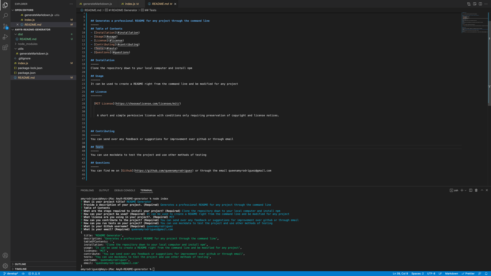

# README Generator

  
  
    

## Generates a professional README for any project through the command line
-----
## Table of Contents
- [Installation](#installation)
- [Usage](#usage)
- [License](#license)
- [Contributing](#contributing)
- [Tests](#tests)
- [Questions](#questions)

## Installation
-----
Clone the repository down to your local computer and install npm

## Usage
------
It can be used to create a README right from the command line and be modified for any project

[Demo Video](https://www.youtube.com/watch?v=p-fYSXSprT8)

## License
-------

  [MIT License](https://choosealicense.com/licenses/mit/)
    

    A short and simple permissive license with conditions only requiring preservation of copyright and license notices.
    

## Contributing
------
You can send over any feedback or suggestions for improvement over github or through email

## Tests
-----
You can use mockdata to test the project and use other methods of testing

## Questions
-----
You can find me on [Github](https://github.com/queenamyrodriguez) or through the email queenamyrodriguez@gmail.com

